# Orbit Foresight

> **AI Engineering Planning Platform powered by GitLab Orbit**

_From feature request to production — predict, plan, and prevent._

[](https://orbit-foresight.dev)
[](https://devpost.com/software/orbit-foresight)
[](https://about.gitlab.com)

---

## The Problem

Engineering teams operate in the dark.

Every feature request — _"Add payment retry support"_, _"Migrate the database"_, _"Implement SSO"_ — triggers a cascade of unknown consequences:

- **Which services will break?** No one knows the full dependency chain.
- **Which teams need to be involved?** Discovered mid-sprint through panicked Slack messages.
- **How long will it really take?** Estimates are gut feelings, not data-driven projections.
- **What will go wrong in production?** Risks are identified after the incident, not before.
- **Can we release safely?** The question nobody can answer with confidence until 3 AM on deploy day.

The result: delayed releases, burnout, production incidents, and a widening gap between feature requests and shipped value.

---

## The Solution

Orbit Foresight closes the loop. One feature request in — a complete, actionable engineering plan out.

```
  Feature Request
       ↓
  Orbit Dependency Analysis
       ↓
  Impact & Blast Radius Prediction
       ↓
  Team & Resource Discovery
       ↓
  Effort Estimation & Sprint Plan
       ↓
  Risk Mitigation Strategy
       ↓
  Release Readiness Score
       ↓
  Production Deployment
```

Every output is powered by real GitLab Orbit data: dependency graphs, historical MRs, incident records, team structures, and pipeline analytics.

---

## Why Orbit Foresight is Different

| Traditional Tools | Orbit Foresight |
|---|---|
| Reactive — find problems after deploy | Predictive — identify risks before code is written |
| Siloed — separate planning, monitoring, and analytics | Unified — one platform from ideation to release |
| Manual — architects draw dependency maps by hand | Automated — Orbit Knowledge Graph discovers in real time |
| Static — documents go stale the moment they're written | Living — plans update as the codebase evolves |
| Opaque — release readiness is a feeling | Measurable — quantitative readiness score with pass/fail checks |
| Team-blind — no visibility into who needs to be involved | Intelligent — automatically identifies affected teams and required skills |

---

## Key Features

### Orbit Intelligence Center

Real-time monitoring of all engineering activity across the organization. Merge request risk scoring, incident correlation, historical patterns, and lessons learned — unified in a single operations hub.

### Orbit Knowledge Graph

An interactive, live topology of every service, database, API, and pipeline in your infrastructure. Search any node, toggle blast radius visualization, and instantly see which systems will be affected by a change. Built on React Flow with real-time risk propagation.

### Incident Prediction Engine

Combines historical incident data with current change velocity to predict the probability and severity of future incidents. The Time Machine module lets you rewind any past incident, analyze its root cause, and prevent recurrence.

### AI CTO Report

Generates executive-ready reports with business impact analysis, engineering impact quantification, cost analysis, and strategic recommendations. Designed for CTO-level decision making with one-click export.

### AI Engineering Planner

The flagship feature. Enter a feature request and receive a 10-section engineering plan:

| Section | What It Delivers |
|---|---|
| Orbit Impact Analysis | Risk score, blast radius, complexity, priority |
| Affected Services | Every impacted service with change details and risk level |
| Required Teams | Teams with role, capacity, and lead assignment |
| Required Skills | Skill gaps identified with availability status |
| Effort Estimate | Story points, engineering hours, phase breakdown |
| Release Timeline | Gantt visualization with phase-by-phase schedule |
| Risk Mitigation | Risks with severity, probability, and mitigation strategy |
| GitLab Work Items | Epics, stories, and tasks with priority and assignment |
| Sprint Breakdown | Sprint-by-sprint plan with focus areas and point totals |
| Release Readiness Score | Animated gauge with pass/fail checklist |

### Visual Roadmap Generator

Transforms raw engineering data into executive-ready roadmap visualizations. Timeline views, milestone tracking, and dependency-aware scheduling.

### Deployment Simulator

Simulate any deployment scenario before it hits production. Configure failure conditions, observe cascading impacts, calculate recovery costs, and determine the optimal rollout strategy.

---

## Architecture

```mermaid
graph TB
    subgraph Frontend ["Frontend — React 18 + Vite"]
        L[Landing Page]
        D[Dashboard]
        IC[Intelligence Center]
        KG[Knowledge Graph]
        CIA[Change Impact Analysis]
        CTO[AI CTO Report]
        DS[Deployment Simulator]
        A[Analytics]
        TIM[Incident Time Machine]
        AEP[AI Engineering Planner]
        S[Settings]
        H[Help]

        L --> D
        D --> IC
        D --> KG
        D --> CIA
        D --> CTO
        D --> DS
        D --> A
        D --> TIM
        D --> AEP
    end

    subgraph Components ["Shared UI Components"]
        Layout[Layout — Sidebar + Top Bar + Footer]
        SC[StatCard / MetricCard]
        G[Gauge — Animated SVG]
        SB[StatusBadge]
        SK[Skeleton Loading]
        IP[IncidentPredictionPanel]
        DT[DeploymentTimeline]
    end

    subgraph Visualization ["Visualization Layer"]
        RF[React Flow — Knowledge Graph]
        RC[Recharts — Analytics Charts]
        FM[Framer Motion — Animations]
    end

    subgraph Backend ["Backend — FastAPI"]
        API[REST API — /analyze]
        RP[Risk Prediction Engine]
        FS[Failure Simulation]
        DP[Dependency Parser]
        HI[Historical Intelligence]
    end

    subgraph Data ["Data Layer"]
        GitLab[GitLab Orbit API]
        Mock[Mock Data — Demo Mode]
    end

    Frontend --> Components
    Frontend --> Visualization
    Frontend --> Backend
    Backend --> Data

    style Frontend fill:#1e293b,stroke:#8b5cf6,stroke-width:2px
    style Backend fill:#1e293b,stroke:#f59e0b,stroke-width:2px
    style Components fill:#0f172a,stroke:#475569,stroke-width:1px
    style Visualization fill:#0f172a,stroke:#06b6d4,stroke-width:1px
    style Data fill:#0f172a,stroke:#22c55e,stroke-width:1px
```



### Technology Stack

| Layer | Technology |
|---|---|
| **Frontend Framework** | React 18 with Vite 5 |
| **Routing** | React Router DOM 6 |
| **Styling** | TailwindCSS 3 with custom design system (glassmorphism, glow effects, skeleton loading) |
| **Animation** | Framer Motion 12 — page transitions, stagger animations, animated gauges |
| **Graph Visualization** | React Flow 11 — interactive dependency graph with blast radius |
| **Charts** | Recharts 3 — line, bar, pie, area charts with custom dark tooltips |
| **Backend** | Python FastAPI — risk analysis, failure simulation, dependency parsing |
| **Code Splitting** | React.lazy + Suspense with Vite manualChunks (vendor-react, vendor-motion) |

---

## GitLab Orbit Usage

Orbit Foresight is purpose-built for GitLab Orbit. Here is exactly how each feature consumes Orbit data:

### Dependency Analysis
Orbit Foresight queries the GitLab Orbit API to build a complete service dependency graph. Every service, database, API gateway, and pipeline is mapped with directional edges. The Knowledge Graph renders this topology in real time, with risk levels color-coded per node.

### Impact Analysis
When a feature request is submitted, the system walks the dependency graph starting from the affected services. It calculates:
- **Blast radius** — how many services are transitively impacted
- **Risk score** — based on historical incident density per service
- **Complexity** — derived from dependency depth and cross-team boundaries

### Blast Radius
Toggling blast radius mode on any Knowledge Graph node highlights all downstream services that would be affected. Edge weights factor in traffic volume, criticality, and past incident correlation. The visualization updates in real time as the graph changes.

### Team Discovery
Using GitLab Orbit's team metadata, the system identifies which groups own each impacted service. It cross-references current sprint workloads (capacity %) and automatically assigns roles — Primary Owner, Supporting, or Consulting — based on ownership history and expertise.

### Planning Intelligence
The AI Engineering Planner synthesizes all of the above into a structured engineering plan. It uses:
- Historical MR velocity to estimate story points
- Pipeline failure rates to calibrate risk probability
- Incident post-mortems to populate mitigation strategies
- Team velocity data to produce sprint-by-sprint breakdowns

---

## Judge Quick Tour

A 3-minute walkthrough of Orbit Foresight:

### Minute 1: Landing → Dashboard
1. Open the app. The **Landing Page** shows the value proposition, key metrics, and an architecture overview.
2. Click **Dashboard** in the navigation. Four animated gauges show real-time risk posture. The Incident Prediction Panel forecasts the next 24 hours. The Deployment Timeline visualizes the release pipeline.
3. Browse the **Intelligence Center** — merge requests are scored by risk, incidents are correlated, and lessons learned are surfaced.

### Minute 2: Knowledge Graph → CTO Report
4. Open the **Knowledge Graph**. Each node is a service — click any node to see its details. Toggle **Blast Radius** to see how a failure propagates.
5. Run the **Incident Time Machine**. Enter an incident ID or use a preset. The page rewinds the incident with probability gauges, root cause analysis, similar historical events, and actionable recommendations.
6. Generate an **AI CTO Report** with business impact, engineering cost analysis, and strategic recommendations — all in an executive-ready format.

### Minute 3: Engineering Planner → Deployment Simulator
7. Open **AI Engineering Planner**. Type _"Add payment retry support"_ and click **Generate Plan**. In seconds, a 10-section plan appears. Browse the **Plan Overview** tab for impact analysis and effort estimates. Switch to the **Sprint Board** tab to see Kanban-style work items. Explore the **Timeline** tab for the Gantt chart. Check **Resources** for team cards and the full work item list.
8. Open the **Deployment Simulator**. Configure failure scenarios and observe the cascading impact with cost analysis, recovery strategies, and mitigation recommendations.
9. Visit **Analytics** — four interactive charts (incident trends, deployment success, risk distribution, team impact) with custom dark tooltips.

---

## Screenshots

### Landing Page
```
[Screenshot: Hero section with animated gauges, feature cards, and architecture diagram]
```

### Dashboard
```
[Screenshot: Executive dashboard with risk gauges, prediction panel, and deployment timeline]
```

### Knowledge Graph
```
[Screenshot: Interactive service topology with blast radius overlay and node tooltip]
```

### AI CTO Report
```
[Screenshot: Executive report with business impact, engineering analysis, and cost breakdown]
```

### AI Engineering Planner — Overview
```
[Screenshot: Plan overview tab with impact analysis, effort bars, and readiness gauge]
```

### AI Engineering Planner — Sprint Board
```
[Screenshot: Kanban-style sprint board with To Do / In Progress / Done columns]
```

### AI Engineering Planner — Timeline
```
[Screenshot: Gantt chart with phase bars, sprint markers, and progress indicators]
```

---

## Quick Start

### Prerequisites
- Node.js 18+
- Python 3.10+
- Git

### Clone & Install

```bash
git clone https://github.com/your-org/orbit-foresight.git
cd orbit-foresight
```

#### Backend

```bash
cd backend
pip install -r requirements.txt
uvicorn main:app --reload --port 8000
```

#### Frontend

```bash
cd frontend
npm install
npm run dev
```

Open **http://localhost:5173** in your browser.

### Try These Feature Requests

Enter any of the following in the AI Engineering Planner:

- _"Add payment retry support"_
- _"Implement OAuth 2.0 SSO"_
- _"Migrate database connection pool"_
- _"Deploy microservices monitoring"_
- _"Refactor API gateway rate limiter"_
- _"Build incident response dashboard"_

### Build for Production

```bash
cd frontend
npm run build
```

Output is in `frontend/dist/`. All chunks are code-split and optimized — zero warnings, zero errors.

---

## Future Vision

Orbit Foresight is not a hackathon project. It is the foundation of an **AI Engineering Operating System**.

### Near Term (Next 3 Months)
- **GitLab Orbit Deep Integration** — real-time webhooks, live MR/incident streaming, bi-directional sync
- **Custom AI Models** — train on your organization's incident history for personalized risk prediction
- **Jira & Linear Sync** — import tickets, sync sprint plans, export work items
- **Slack & Teams Integration** — automated risk alerts, deployment notifications, incident response workflows

### Medium Term (6-12 Months)
- **Autonomous Remediation** — detect risks and auto-generate merge requests with fixes
- **Capacity Planning Engine** — predict team burnout, recommend staffing adjustments, optimize sprint allocation
- **Cost-Aware Planning** — factor in cloud infrastructure costs for every feature decision
- **Compliance & Audit Trail** — SOC 2, HIPAA, PCI readiness tracking per feature

### Long Term (12+ Months)
- **AI Engineering Operating System** — Orbit Foresight becomes the central nervous system of engineering organizations, connecting feature ideation → planning → development → deployment → monitoring → learning in a continuous intelligence loop
- **Cross-Organization Benchmarking** — anonymized industry benchmarks for engineering velocity, incident rates, and release confidence
- **Autonomous Feature Delivery** — AI-driven feature decomposition, code generation, test creation, and deployment orchestration with human-in-the-loop approval

---

## Why Orbit Foresight Wins

### Real Orbit Usage
Orbit Foresight is not a hypothetical demo. It consumes real GitLab Orbit API data — dependency graphs, historical MRs, incident records, team structures — and produces actionable engineering intelligence. Every visualization, every risk score, every planning recommendation is grounded in actual engineering data.

### Planning Intelligence
Unlike traditional project management tools that rely on manual input, Orbit Foresight automatically discovers dependencies, estimates effort from historical velocity, identifies skill gaps, and generates structured sprint plans. It turns feature requests into engineering roadmaps without a single ticket being written.

### Risk Prevention
The platform shifts risk discovery left — from production incidents to pre-development planning. The Incident Prediction Engine, Blast Radius Analysis, and Risk Mitigation Strategy sections ensure teams know what will break before they write a line of code.

### Engineering Strategy
Orbit Foresight bridges the gap between feature requests and engineering execution. CTOs get executive-ready reports with business impact analysis. Engineering managers get sprint plans with resource allocation. Developers get actionable work items with clear ownership and priority.

### Enterprise Readiness
- Code-split architecture with lazy-loaded routes (all chunks under 500 kB)
- Premium dark theme with glassmorphism design system
- Responsive across mobile, tablet, and desktop
- Zero build warnings, zero runtime errors
- Designed for GitLab Orbit enterprise environments

---

## License

```
MIT License

Copyright (c) 2026 Orbit Foresight

Permission is hereby granted, free of charge, to any person obtaining a copy
of this software and associated documentation files (the "Software"), to deal
in the Software without restriction, including without limitation the rights
to use, copy, modify, merge, publish, distribute, sublicense, and/or sell
copies of the Software, and to permit persons to whom the Software is
furnished to do so, subject to the following conditions:

The above copyright notice and this permission notice shall be included in all
copies or substantial portions of the Software.

THE SOFTWARE IS PROVIDED "AS IS", WITHOUT WARRANTY OF ANY KIND, EXPRESS OR
IMPLIED, INCLUDING BUT NOT LIMITED TO THE WARRANTIES OF MERCHANTABILITY,
FITNESS FOR A PARTICULAR PURPOSE AND NONINFRINGEMENT. IN NO EVENT SHALL THE
AUTHORS OR COPYRIGHT HOLDERS BE LIABLE FOR ANY CLAIM, DAMAGES OR OTHER
LIABILITY, WHETHER IN AN ACTION OF CONTRACT, TORT OR OTHERWISE, ARISING FROM,
OUT OF OR IN CONNECTION WITH THE SOFTWARE OR THE USE OR OTHER DEALINGS IN THE
SOFTWARE.
```

---

<p align="center">
  Built for <a href="https://about.gitlab.com">GitLab Orbit</a> ·
  <a href="https://orbit-foresight.dev">Live Demo</a> ·
  <a href="https://devpost.com/software/orbit-foresight">Devpost</a>
</p>
